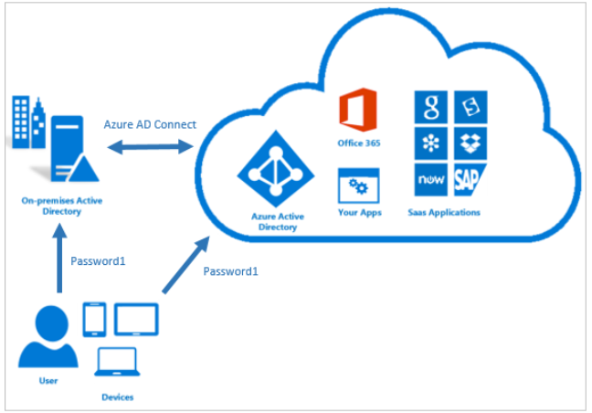
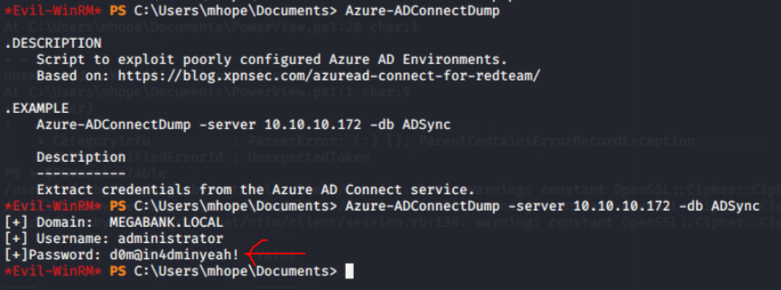

## Description
`Azure-ADConnectDump` exploits misconfigured Azure AD environments that implement Password Hash Synchronization to extract credentials from the Azure AD Connect service. 

### Finding the Sync Server & Account
Get-ADUser -LDAPFilter "(samAccountName=MSOL_*)" -properties name,description | select name,description | fl

### Usage
```
Usage: Azure-ADConnectDump -server  -db

EXAMPLE: Azure-ADConnectDump -server 10.10.10.172 -db ADSync
```

## Password Hash Synchronization (Summary)
Password Hash Synchronization (PHS) is one of the sign-in methods you can configure with Azure. The passwords from on-premise AD are actually sent to the cloud, similar to how domain controllers synchronize passwords between each other via replication. This is done from a service account that is created with the installation of AD Connect



This introduces a unique attack path where if the synchronization account is compromised, it has enough privileges which potentially could lead to the compromise of the on-premise AD forest, as that account is granted replication rights which are needed for DCSYNC. DCSync  impersonates the behaviour of the Domain Controller and requests account password data from the targeted Domain Controller. Putting it simple all this means is that if you are able to compromise a server containing the Azure AD Connect service, and gain access to either the ADSyncAdmins or local Administrators groups (which our user mhope is a part of), what you have is the ability to retrieve the credentials for an account capable of performing a DCSync. 


### Example

Checking the user permissions we see that we are part of the Azure admins group.


Running the exploit gives us the administrator creds in clear text



### Additional Information
 - https://www.youtube.com/watch?v=JEIR5oGCwdg


